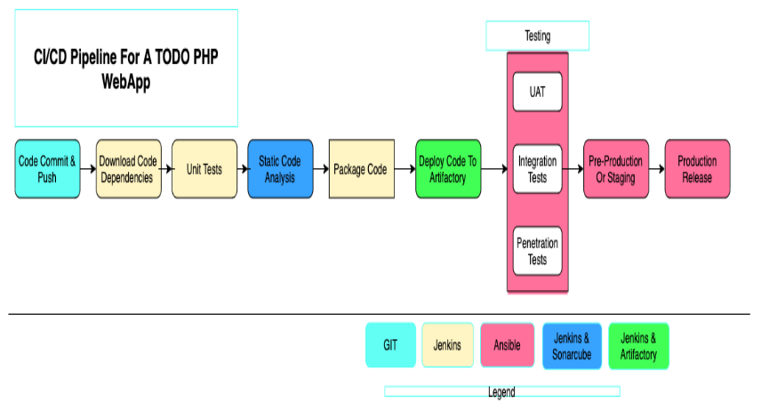
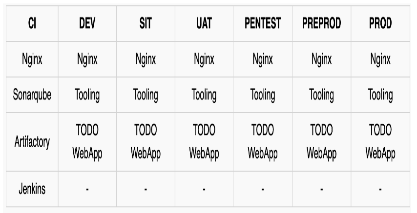
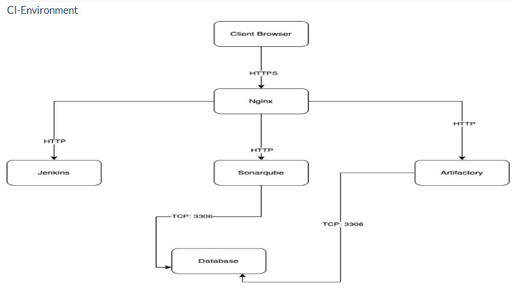
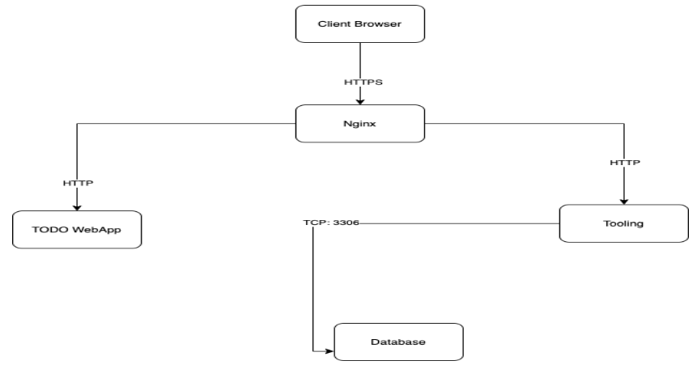
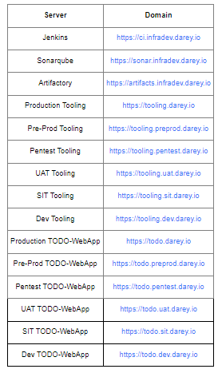

# Simulating a typical CI/CD Pipeline for a PHP Based application

---

As part of the ongoing infrastructure development with Ansible started from a previous a project, we will create a pipeline that simulates continuous integration and delivery.

Target end to end CI/CD pipeline is represented by the diagram below.



It is important to know that both Tooling and TODO Web Applications are based on an interpreted (scripting) language (PHP).
It means, it can be deployed directly onto a server and will work without compiling the code to a machine language.

The problem with that approach is, it would be difficult to package and version the software for different releases.

And so, in this project, we will be using a different approach for releases, rather than downloading directly from git, we will be using Ansible uri module
---

## Set Up

This project is partly a continuation of our Ansible project, so e will simply add and subtract based on the new setup in this project.

It will require a lot of servers to simulate all the different environments from ***dev/ci*** all the way to production.

There will be quite a lot of servers altogether.

But won't create them all at once. Only create servers required for an environment you are working with at the moment.

For example, when doing deployments for development, do not create servers for integration, pentest, or production yet.

We will try to utilize our AWS free tier as much as we can. To minimize the cost of cloud servers, we will not create all the servers at once, we will simply spin up a minimal server set up as you progress through the project implementation and have reached a need for more.

> Alternatively, we can use Google Cloud (GCP) to rent virtual machines from this cloud service provider - you can get $300 credit here or here (NOTE: Please read instructions carefully to get your credits)  ***NOTE***: All we need here is virtual machines that can be accessed over SSH.
---

## SIT & UAT

* SIT - For System Integration Testing
* UAT - User Acceptance Testing

To get started, we will focus on these environments initially.

• Ci

• Dev

• Pentest

Both SIT and UAT require a lot of extra installation or configuration. They are basically the webservers holding our applications.

But ***Pentest*** - For Penetration testing is where we will conduct security related tests, so some other tools and specific configurations will be needed.

In some cases, it will also be used for Performance and Load testing.

Otherwise, that can also be a separate environment on its own. It all depends on decisions made by the company and the team running the show.

What we want to achieve, is having Nginx to serve as a reverse proxy for our sites and tools. Each environment setup is represented in the below table and diagrams.



### CI environment



## Other environments from lower to higher



## DNS requirements

Make DNS entries to create a subdomain for each environment.
Assuming your main domain is darey.io
You should have a subdomains list like this:




## Ansible inventory should look like this

```
├── ci
├── dev
├── pentest
├── pre-prod
├── prod
├── sit
└── uat
```

## ci inventory file

```
[jenkins]
<Jenkins-Private-IP-Address>

[nginx]
<Nginx-Private-IP-Address>

[sonarqube]
<SonarQube-Private-IP-Address>

[artifact_repository]
<Artifact_repository-Private-IP-Address>

```

## dev inventory file

```
[tooling]
<Tooling-Web-Server-Private-IP-Address>

[todo]
<Todo-Web-Server-Private-IP-Address>

[nginx]
<Nginx-Private-IP-Address>

[db:vars]
ansible_user=ec2-user
ansible_python_interpreter=/usr/bin/python

[db]
<DB-Server-Private-IP-Address>

```

## pentest inventory file

```
[pentest:children]
pentest-todo
pentest-tooling

[pentest-todo]
<Pentest-for-Todo-Private-IP-Address>

[pentest-tooling]
<Pentest-for-Tooling-Private-IP-Address>

```

### Observations

1. You will notice that in the pentest inventory file, we have introduced a new concept ***pentest:children*** This is because, we want to have a group called pentest which covers Ansible execution against both pentest-todo and pentest-tooling simultaneously. But at the same time, we want the flexibility to run specific Ansible tasks against an individual group.

2. The db group has a slightly different configuration. It uses a RedHat/Centos Linux distro. Others are based on Ubuntu (in this case user is ubuntu). Therefore, the user required for connectivity and path to python interpreter are different. If all your environment is based on Ubuntu, you may not need this kind of set up. Totally up to you how you want to do this. Whatever works for you is absolutely fine in this scenario.

This makes us to introduce another Ansible concept called group_vars.
With group vars, we can declare and set variables for each group of servers created in the inventory file.
For example, If there are variables we need to be common between both pentest-todo and pentest-tooling, rather than setting these variables in many places, we can simply use the group_vars for pentest. Since in the inventory file it has been created as pentest:children Ansible recognizes this and simply applies that variable to both children.

Ansible roles for ci environment
Ansible Roles for CI Environment
Add two more roles to ansible:

1. SonarQube (Scroll down to the Sonarqube section to see instructions on how to set up and configure SonarQube manually) 2. Artifactory
Why do we need SonarQube?
SonarQube is an open-source platform developed by Sonar Source for continuous inspection of code quality, it is used to perform automatic reviews with static analysis of code to detect bugs, code smells, and security vulnerabilities. Watch a short description here. There is a lot more hands on work ahead with SonarQube and Jenkins. So, the purpose of SonarQube will be clearer to you very soon.
Why do we need Artifactory?
Artifactory is a product by JFrog that serves as a binary repository manager. The binary repository is a natural extension to the source code repository, in that the outcome of your build process is stored. It can be used for certain other automation, but we will it strictly to manage our build artifacts.
Watch a short description here Focus more on the first 10.08 mins

Watch a short description here Focus more on the first 10.08 mins
Configuring Ansible For Jenkins Deployment
In previous projects, you have been launching Ansible commands manually from a CLI. Now, with Jenkins, we will start running Ansible from Jenkins UI.
To do this,

1. Navigate to Jenkins URL

2. Install & Open Blue Ocean Jenkins Plugin
3. Create a new pipeline


